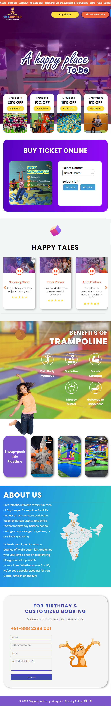
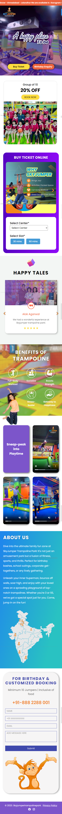

# Trampoline Park Website 🤸

A website theme inspired by Trampoline Parks, developed as part of an assignment. This project is a clone that you can customize according to your needs. Developed using HTML, CSS, JavaScript, jQuery, and the GlideJs library for carousels.

## Features 🎉

- **Theme:** Trampoline Park-inspired design.
- **Technologies:** HTML, CSS, JavaScript, jQuery, GlideJs.
- **Customizable:** Easy to adapt and personalize.
- **SEO Optimized:** Designed with search engine optimization in mind.

## Demo 🌐

View the live demo [here](https://abkrishna.me/SkyJumper-Clone/).

## Screenshots 📸

*Full page screenshot of large screen desktop view.*

*Full page screenshot of regular screen latop view.*

*Full page screenshot of tablet view.*

*Full page screenshot of mobile view.*

## Technologies Used 🛠️

- [HTML](https://developer.mozilla.org/en-US/docs/Web/HTML)
- [CSS](https://developer.mozilla.org/en-US/docs/Web/CSS)
- [JavaScript](https://developer.mozilla.org/en-US/docs/Web/JavaScript)
- [jQuery](https://jquery.com/)
- [GlideJs](https://glidejs.com/)

## Usage Instructions 🚀

1. Clone the repository to your local machine.
2. Open the `index.html` file in a web browser.
3. Customize the content and design according to your preferences.

## Contributing 🤝

If you have any feedback or want to contribute to this project, feel free to contact the developer, Azim Krishna at azimbaji19@gmail.com

Enjoy exploring the Trampoline Park experience! 🎉
